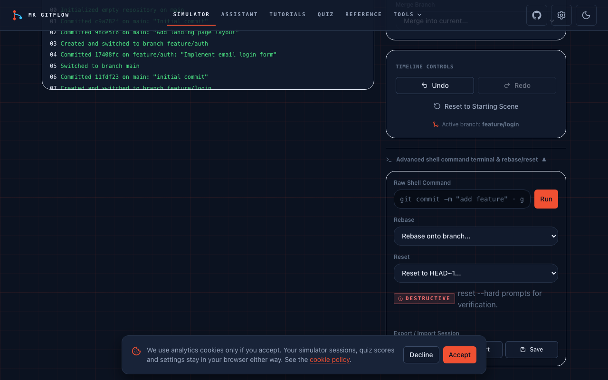
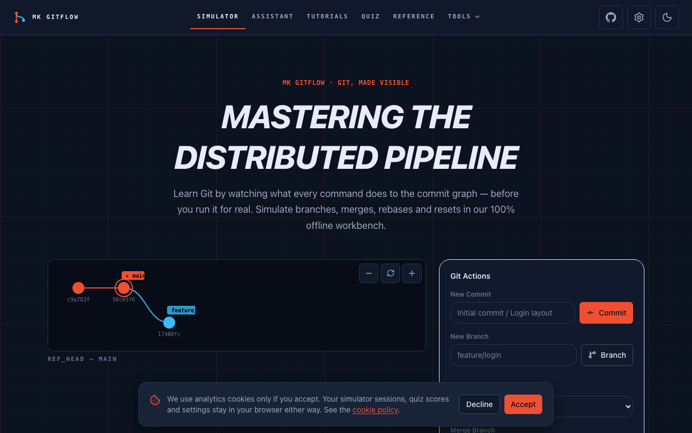

# MK GitFlow

Interactive Git learning and tooling platform. Simulate `commit`, `branch`, `checkout`,
`merge`, `rebase`, and `reset` on a live visual branch graph, follow guided tutorials,
look up a risk-graded command reference, and analyze public repository health — all
local-first, with no accounts and no server database.

**The site never executes shell commands.** It only *simulates* Git in-memory and
*displays* commands with copy buttons. That is a deliberate safety property and a stated
product principle.

- Production: https://gitflow.mkazi.live
- Repository: https://github.com/mk-knight23/44-tool-github-desktop-guide
- License: MIT · Author: [Kazi Musharraf](https://www.mkazi.live)

## Screenshots

The branch simulator (deterministic core) and the landing page:




> Screenshots are generated by the Playwright smoke test, not hand-picked mockups.

## Features

- **Branch simulator (`/tool`)** — an in-memory Git DAG engine (zero DOM dependencies)
  rendered as an SVG branch graph. Step-by-step undo/redo, time-travel, JSON
  export/import, a screen-reader command log, and a confirm gate on destructive resets.
- **Guided tutorials (`/tutorials`)** — GitHub Desktop and CLI paths across beginner,
  intermediate, and advanced levels, with local progress tracking.
- **Command reference (`/reference`)** — 40+ commands, each with syntax, plain-English
  explanation, examples, a risk level (safe / caution / destructive), undo guidance, and
  a page per command.
- **Deterministic tools** — `.gitignore` generator (`/gitignore`), Conventional Commit
  builder (`/commits`), and an undo/recovery decision helper (`/undo`). All work offline.
- **Repo analyzer (`/analyzer`)** — scores a public repo's docs health against a
  documented rubric using GitHub's unauthenticated REST API, with an actionable checklist.
- **Quizzes (`/quiz`)** — topic quizzes with per-question explanations, results stored
  locally.
- **AI assistant (`/assistant`)** — nine capabilities (NL→command, error/conflict
  explainers, rebase/branch planning, PR & release drafting, CI triage) behind honest
  availability states, deterministic fallbacks where they exist, and an optional
  bring-your-own-key path.

## Tech stack

| Area | Choice |
|---|---|
| Framework | Next.js 16 (App Router, `src/` dir), React 19, TypeScript strict |
| Styling | Tailwind CSS v4 (`@theme` tokens), system font stacks, no CDNs |
| Icons | lucide-react |
| Validation | Zod (all API input) |
| AI | Vercel AI SDK v6 via gateway model strings (no direct provider SDK) |
| Persistence | IndexedDB via `idb` (`src/lib/storage.ts`); localStorage for tiny prefs |
| Unit tests | Vitest + Testing Library (jsdom) |
| E2E | Playwright (Chromium) |

See [ARCHITECTURE.md](ARCHITECTURE.md) for the module map and [AI_ARCHITECTURE.md](AI_ARCHITECTURE.md)
for the AI layer.

## Getting started

Requires Node 22+ and pnpm 11+.

```bash
pnpm install
pnpm dev            # http://localhost:3000
```

Every deterministic tool works with no environment variables set.

## Environment variables

All optional — see [.env.example](.env.example) for the full, commented list.

| Variable | Purpose | Default |
|---|---|---|
| `NEXT_PUBLIC_SITE_URL` | Canonical origin for metadata / sitemap / OG | `https://gitflow.mkazi.live` |
| `AI_GATEWAY_API_KEY` | Vercel AI Gateway key (local/self-host); Vercel uses OIDC in prod | unset ⇒ AI degrades honestly |
| `AI_MODEL` / `AI_MODEL_QUALITY` | Gateway model strings (config, not code) | `anthropic/claude-haiku-4.5` / `...sonnet-4-5` |
| `NEXT_PUBLIC_GTM_ID` | Google Tag Manager id | unset ⇒ analytics fully disabled |
| `NEXT_PUBLIC_ADSENSE_ENABLED` | Ad slot toggle (prepared, off) | `false` |

The BYOK key is never an environment variable: it is held only in the browser and sent
per request in the `x-byok-key` header, never stored or logged.

## Testing

```bash
pnpm typecheck        # tsc --noEmit
pnpm lint             # eslint
pnpm test             # vitest run
pnpm test:coverage    # vitest run --coverage
pnpm build            # next build
pnpm e2e              # playwright test (build first; serves on port 3105)
```

The Git engine is the most-tested code in the repo (>90% coverage, enforced in
`vitest.config.ts`). Real results are recorded in [TEST_REPORT.md](TEST_REPORT.md).

For Playwright, build once (`pnpm build`) then run `pnpm e2e`; the config serves the
production build on port 3105 and runs a desktop + mobile + keyboard smoke of the
simulator flow. First-time setup: `pnpm exec playwright install chromium`.

## Deployment

Deploys as a standard Next.js app on Vercel. See [DEPLOYMENT.md](DEPLOYMENT.md) for the
build settings, environment variables, security headers, and rollback steps. CI
(`.github/workflows/ci.yml`) runs typecheck, lint, unit tests, build, a gitleaks secret
scan, a dependency audit, and the Playwright smoke.

## Privacy & security

Local-first by design: progress, quiz scores, simulator sessions, and analyses live in
your browser (IndexedDB). AI request content is processed transiently and never stored
or logged server-side. Analytics stay fully disabled until you accept, and never carry
command text, repo names, quiz content, or keys. See [PRIVACY.md](PRIVACY.md) and
[SECURITY.md](SECURITY.md) (threat model + responsible disclosure).

## Documentation

[PRODUCT_SPEC](PRODUCT_SPEC.md) · [ARCHITECTURE](ARCHITECTURE.md) ·
[AI_ARCHITECTURE](AI_ARCHITECTURE.md) · [DATABASE](DATABASE.md) ·
[DESIGN_SYSTEM](DESIGN_SYSTEM.md) · [SEO_PLAN](SEO_PLAN.md) ·
[ANALYTICS_PLAN](ANALYTICS_PLAN.md) · [MONETIZATION_PLAN](MONETIZATION_PLAN.md) ·
[TEST_REPORT](TEST_REPORT.md) · [DEPLOYMENT](DEPLOYMENT.md) · [CHANGELOG](CHANGELOG.md)

## Roadmap

- Deeper simulator scenes embedded directly in tutorial steps.
- More reference entries and worked examples for advanced history rewriting.
- Optional self-hosted variable fonts if brand pressure justifies leaving system stacks.

Non-goals (V1): no shell execution ever, no accounts, no server database, no GitHub
writes. See [PRODUCT_SPEC.md §4](PRODUCT_SPEC.md).

## Author

Built and maintained by **[Kazi Musharraf](https://www.mkazi.live)** — AI Engineer,
Full-Stack Developer, Open-Source Builder. GitHub: [@mk-knight23](https://github.com/mk-knight23).

Open source under the [MIT License](LICENSE).
